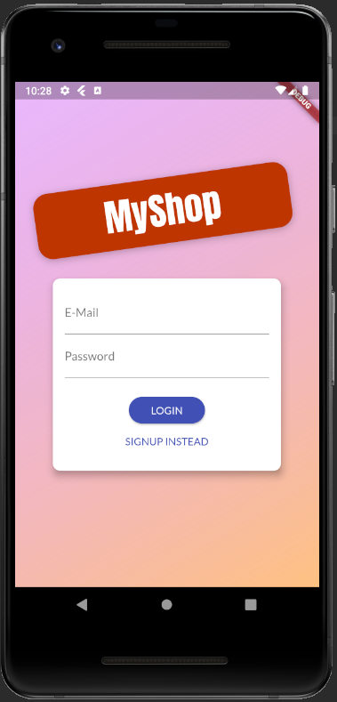
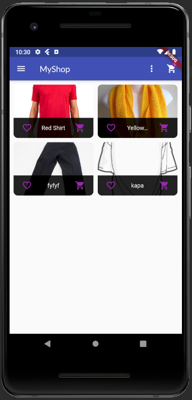
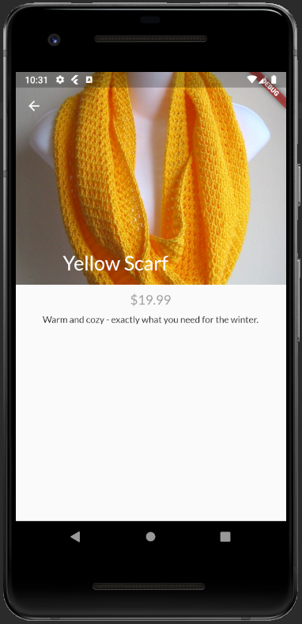
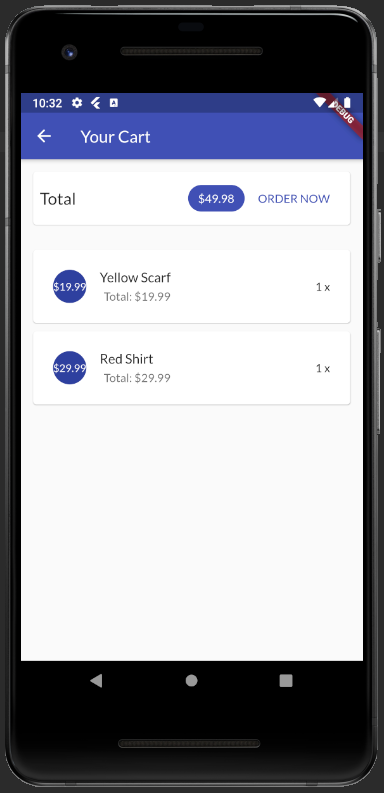
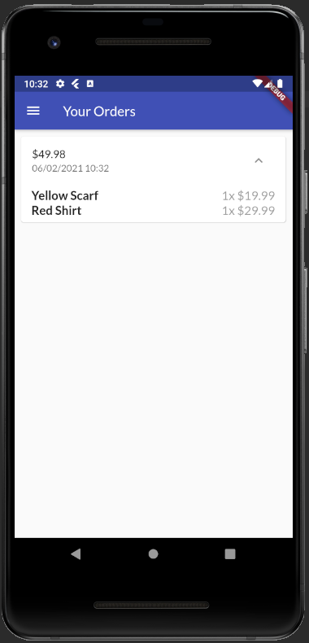
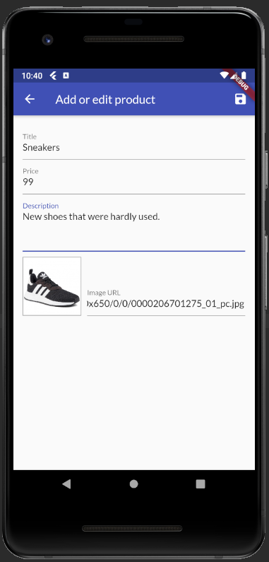
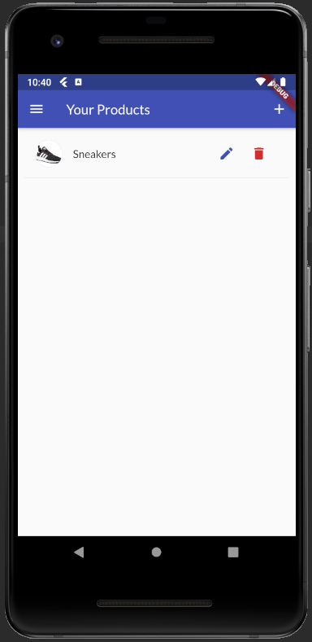

# shopapp

>Flutter, Firebase(Authentication,Realtime Database)

Flutter application which allows to view items for sale by other users.  
The user can:
  

* view other users' items and add them to your favorites
* add, delete, edit items
* add items to the cart and order them
* view order history
## Some Screenshots

#### Login screen

#### All product screen

#### Item preview screen

#### Cart screen

#### Order screen

#### Screen for adding items

#### Added items screen

